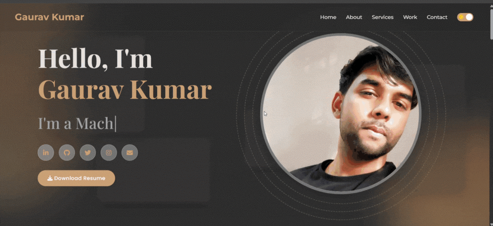

# 🌐 Portfolio Website

This is my personal **portfolio website**, built with HTML, CSS, and JavaScript to showcase my projects, skills, and contact information.

[PORTFOLIO](https://004gaurav.github.io/portfolio/)

---

## 🚀 Features
- 🖼️ Project showcase with images
- 📬 Contact form (email integration)
- 📱 Responsive design for mobile and desktop
- 🎨 Clean and modern UI

---

## 👀 Preview



---

## 📂 Project Structure
```

portfolio/
│── index.html        # Main page
│── style.css         # Stylesheet
│── script.js         # JavaScript (interactions, form handling)
│── images/           # Images, screenshots, or preview GIF
│── README.md         # Project documentation

```

## 📬 Contact
- **Email:** [gauravkumar19994@gmail.com](mailto:gauravkumar19994@gmail.com)  
- **GitHub:** [004Gaurav](https://github.com/004Gaurav)  
- **LinkedIn:** [LinkedIn Profile](https://www.linkedin.com/in/004gaurav)   

---

✨ Feel free to fork this repo and customize it for your own portfolio!


